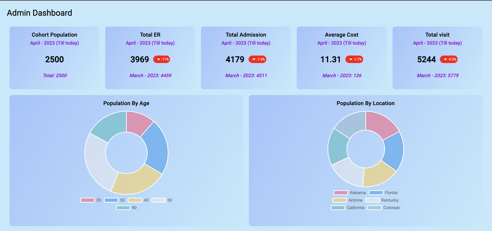
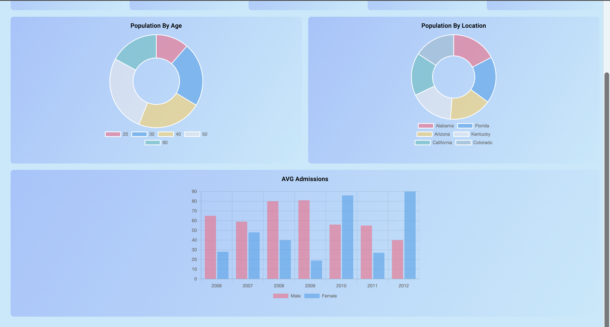

# Analytics Dashboard

## About the Project

This is a simple analytics dashboard for data visualization built using mock data. It has a modular architecture and the layout can be customized from the config file. You can also configure the chart type, datasets, its dimension as well as the layout of the entire page. The dashboard is built using Angular 16 and ng2-charts. The dashboard is responsive and can be viewed on mobile devices as well.

## UI Snapshots

## Setup

- Clone the github repo
- Open terminal, go to the directory and run `npm i`
- Run `npm start` in the terminal which will start the dev server on `localhost:4200`. The application will automatically reload if you change any of the source files.
- Run `ng test` to execute the unit tests via [Karma](https://karma-runner.github.io).

## About the config

- The application is currently connected to the config file hosted at `https://my-json-server.typicode.com/yksolanki9/mock-api/data`
- A copy of the hosted file is present in `src/app/core/utils/dashboard-config.ts`
- Feel free to host your own config file and change the URL in `src/app/core/services/dashboard-config.service.ts` or connect to the local file instead of the hosted one.

## Contact

Please feel free to reach out to me at `yashsolanki1709@gmail.com` in case you have any queries.
